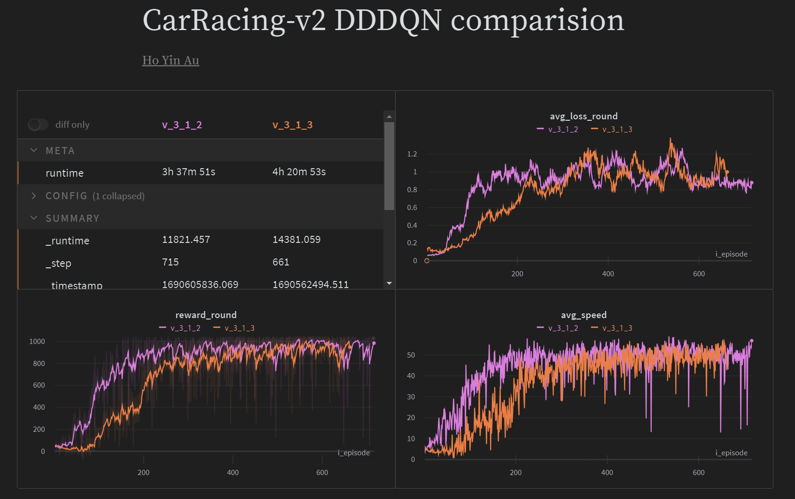
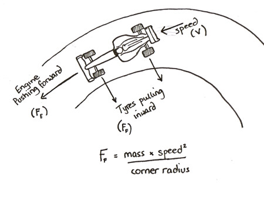
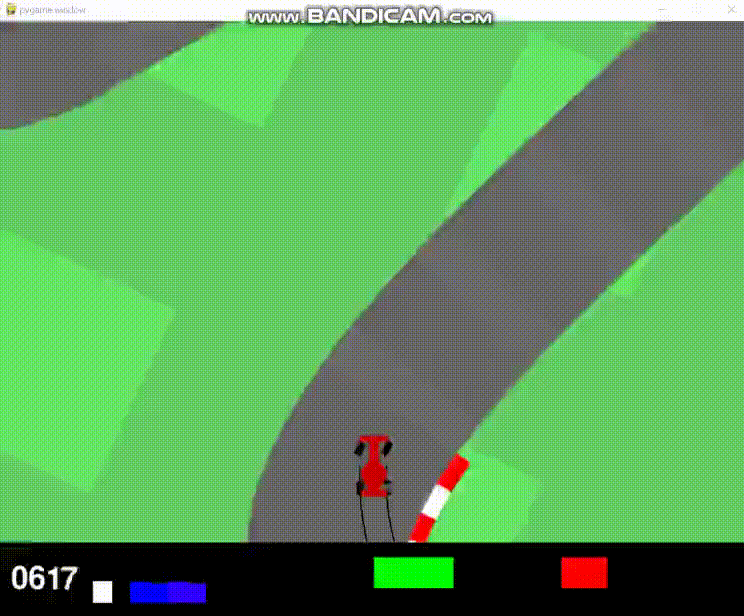
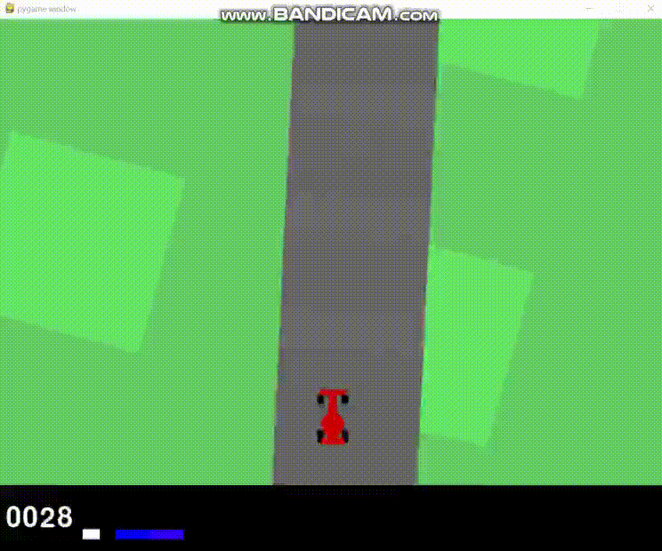

# 2D Reinforcement Learning Autonomous car (gym package: CarRacing-v2)
- Using Double Dueling Deep Q-learning (RL) and Physics knowledge to train the RL agent to drive the car with the action of turning left, turning right, gas, breaking, and doing nothing

## Trick 1: Off-track penalty
- In v_3_1_3, the CNN off-track classifier gives a big penalty if the car is off-track. <mark>It can prevent the car driving on the grass **unnecessarily**</mark>

Info| v_3_1_2: without off track penalty          |  v_3_1_3: with off track penalty
:-------------------------:|:-------------------------:|:-------------------------:
Demo 1 |  |  
Demo 2 |  |  
Training time | Relative short| Relative long
Task difficulty | Low | High

### Learning curve:
  - As the task difficulty of v_3_1_2 is easier, it uses the lesser time to gain 1000 round rewards
  - 

### CNN off-track classifier:
  - use 1500 human-labeled images where half of them are 'on track' and half of them are 'off track' to train, valid and test the classifier
  - 
  - 

## Trick 2: Consider "Velocity" when driving:
  - The output of 'state' from the env is just a static image. If the agent does not know the current velocity, it <mark>can not determine how much centripetal force is required to make a turn</mark> 
  - 
  - To solve this problem, need to use <mark>both the 'state' and 'prev_state'</mark> as input
    - because using the original coordinate and final coordinate can derive the displacement and <mark>velocity</mark>
    - **Velocity formula**
        ```math
        v = \frac{\Delta s}{\Delta t} = \frac{x_f-x_i}{t_f-t_i}
        ```
        where v is the velocity, s is the displacement, t is the time and x is the coordinates

## Trick 3: State processing
  1. As the image is zooming in the first 50 steps so the state (vision) is abnormal and confusing, do not interact with env during that 50 steps
  2. The state (vision) generated from gym includes useless information such as the cumulative reward, current power, and baking power. Clip that useless information can reduce the noise and increase the capacity of the replay buffer   

## Trick 4: Speed up the car and training process
  - As it is racing, the higher the velocity is better
    1. Give a reward if the speed is higher and penalize if the speed is too low
    2. Increased the chance of using gas and reduce the chance of using break, it will realize faster is better in a shorter time 


## Current limitation
  - sometimes the car will off-track if the car comes to a <mark>tight turn with a high velocity</mark>
    - it is a Physics limitation
      - if the car is too fast, most of the displacement is due to the original velocity but not operation adjustment. Therefore, it is impossible to turn it well
        - **Velocity, displacement, and acceleration formula**
      ```math
      \displaylines{v = \frac{\Delta s}{\Delta t} = \frac{x_f-x_i}{t_f-t_i} \\ s =  ut + \frac{1}{2}at^2 = \text{displacement is due to the original velocity + displacement is due to the operation adjustment} \\ a = \frac{\Delta v}{\Delta t}}
      
      ```
      where v is the velocity, s is the displacement, t is the time, x is the coordinates and a is the acceleration
    - 
  1. the best method to fix this issue is to allow the <mark>agent to look further (zoom out the image)</mark>
    - it will increase the agent's consideration time
      1. the agent can <mark>reduce the car speed early</mark> when approaching a tight turn and it will reduce the proportion of displacement due to the original velocity
      2. the agent can <mark>shift the car to the outermost point early</mark> in the road
      - 
  2. give a penalty if the car is too fast can also prevent off-track, but it will limit the car's speed  


### File
1. train_on_track_cls.py: train, valid and test the on-track classifier model
2. train_rl_racing.py: train and test the RL car racing agent
3. simulate_rl_racing.py: simulate the car driving in a random environment

# Principle of Deep Q-learning
___________________________________

  - uses a deep neural network to approximate the different Q-value for each possible action at a state (value-function estimation)
  - has two phases:
    1. sampling: perform actions and store the observed expectations tuples in a replay memory
    2. Training: Select the small batch of tuple randomly and learn from it using a gradient descent update step
  
  - training might suffer from instability. Mainly because of combining a non-linear Q-value function (NN) and bootstrapping (when we update targets <mark>with existing estimates and not an actual</mark> complete return)
    - Solution
      1. Experience Replay
         1. allows us to learn from individual experiences multiple times (avoid forgetting previous experiences)
         2. remove correlation in the observation sequences and avoid action values from oscillating or diverging catastrophically 
         
## Principle of Double DQN
______________________________

- One of the problems of the DQN algorithm is that it overestimates the true rewards
- To fix this, DDQN suggests using a simple trick:
  - decoupling the action selection from the action evaluation


## Principle of Dueling DQN
______________________

- splits the Q-values in two different parts, the value function V(s) and the advantage function A(s,a)
- V(s) tell us how much reward we will collect from state s
- A(s,a) tells us how much better one action is compared to the other actions
- sometimes it is unnecessary to know the exact value of each action, so just learning the state-value function can be enough in some cases 


