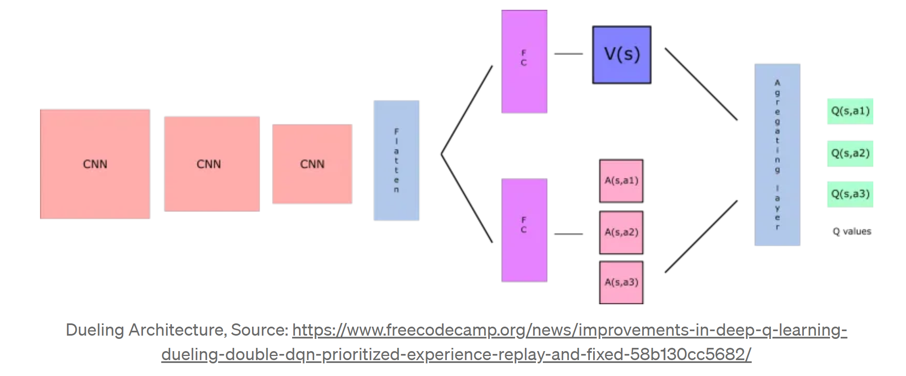

# Experiment 1
________________________________
- Using Double Dueling Deep Q-learning, the RL agent learned how to <mark>drive the car</mark> by turn left, turn right, gas, break and do nothing
- Epochs 219:
  - 
- Epochs 500:
  - to be continued
- Epochs 1000:
  - to be continued
- Epochs 2000:
  - to be continued
- Learning curve
  - 
- Key trick of training this model
  1. To speed up the car, I give a reward if the speed is higher and penalise if speed is too low
  2. A <mark>large amount of epochs</mark> is required to train an agent to drive a car
  3. To reduce the chance of off track, I used <mark>CNN to build another classifier model determine whether off track</mark>. if off track, penalise
     - 
     - 
  4. The output of 'state' from the env is just a static image. The agent <mark>can not determine the velocity of car so the agent is impossible to make a good decision</mark>. To solve this problem, I use both the 'state' and 'prev_state' as input
  5. Clip the image to remove useless information to reduce the noise and memory usage. It can also increase the capacity of replay buffer
  6. As the image is zooming in the first 50 steps and it wil affect learning, do not interact with env
  7. To speed up the training processing, I increased the chance of using gas and reduce the chance of using break
  8. The training time is very long, the capability of further train a previous saved model is very important
 
### File
1. on_track_cls.ipynb: train,valid and test the on track classifier model
2. race dqn discrete.ipynb: train and test the driving RL agent

# Principle of Deep Q-learning
___________________________________

  - uses a deep neural network to approximate the different Q-value for each possible action at a state (value-function estimation)
  - has two phases:
    1. sampling: perform actions and store the observed expectations tuples in a replay memory
    2. Training: Select the small batch of tuple randomly and learn from it using a gradient descent update step

  - training might suffer from instability. Mainly because of combining a non-linear Q-value function (NN) and bootstrapping (when we update targets <mark>with existing estimates and not an actual</mark> complete return)
    - Solution
      1. Experience Replay
         1. allows us to learn from individual experience multiple times (avoid forgetting previous experiences)
         2. remove correlation in the observation sequences and avoid action values from oscillating or diverging catastrophically 

# Principle of Double DQN
-------------------------------

- One of the problems of the DQN algorithm is that is overestimates the true rewards
- To fix this, DDQN suggest using a simple trick:
  - decoupling the action selection from the action evulation

# Principle of Dueling DQN
-------------------------------

- splits the Q-values in two different parts, the value function V(s) and the advantage function A(s,a)
- V(s) tell us how much reward we will collect from state s
- A(s,a) tells us how much better one action is compared to the other actions
- sometimes it is unnecessary to know the exact value of each action, so just learning the state-value function can be enough in some cases 

